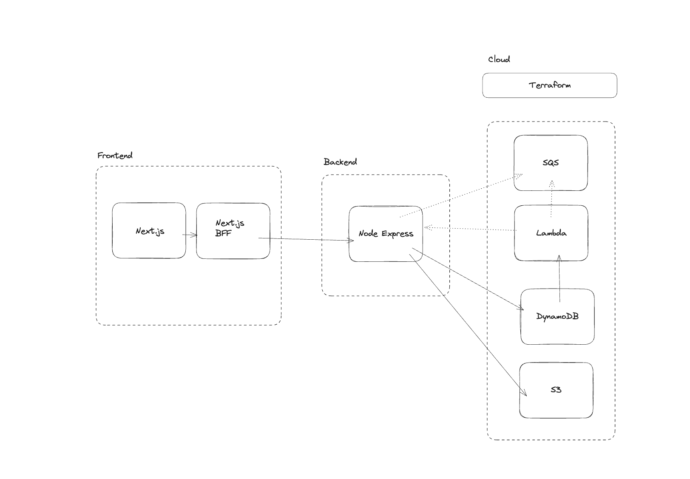
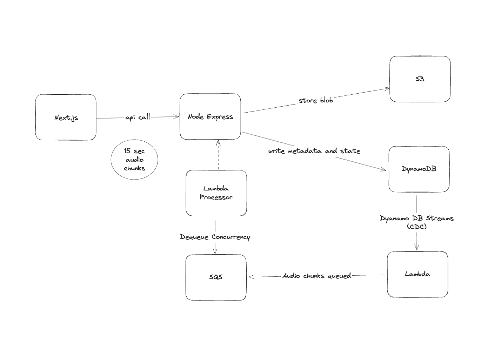

# Design Doc

## 1. Introduction
- **Purpose**: Create a simplified consultation note-taking application
- **Scope**: Audio recording, note-taking, and consultation note generation
- **Key Outcomes**: End-to-end solution development, attention to detail, clean code

## 2. System Architecture
- **Overview**: Modular monolith with event-driven components
- **Components**:
  - Backend: Node.js/Express, modular design, dependency injection
  - Frontend: Next.js with BFF pattern, client-side chunk management
  - Storage: DynamoDB for data, S3 for files (via LocalStack)
- **Message Flow**: Audio uploads → DynamoDB → Summary generation
- **Data Handling**: LocalStack for AWS service simulation



## 3. Data Management
- **Domain Models**:
  - ConsultationSession: Lifecycle, audio status, notes
  - AudioChunk: Metadata, processing state, S3 links
  - ConsultationNote: Annotations with timestamps
- **Database**: DynamoDB with Global Secondary Index (GSI) for status queries
- **Storage**: LocalStack S3 simulation for development

## 4. Security Implementation
- **Authentication**: 
  - Basic Auth with environment variables
  - CORS (Cross-Origin Resource Sharing):
    - Allows frontend to call backend API
    - Controls which domains can access API
    - Implemented via Express middleware:
    ```typescript
    app.use(cors());
    ```
  - Security Headers:
    - HTTP headers that enhance API security
    - Common headers include:
      - `Content-Type`: Prevents MIME sniffing
      - `X-Content-Type-Options`: nosniff
      - `X-Frame-Options`: Prevents clickjacking
      - `X-XSS-Protection`: Basic XSS protection
    ```typescript
    app.use(helmet());
    ```
  - Command/Query pattern
  - Structured error responses

## 5. Implementation Details
- **Core Features**:
  1. Audio Recording:
     - 15-second chunks
     - Immediate upload
     - Progress tracking
  2. Note-taking with timestamps
  3. Summary Generation:
     - Event-driven via DynamoDB Change Data Capture (CDC)
     - Status changes trigger summary generation
     - Template-based output
     - Status tracking (PENDING/COMPLETED/FAILED)
     - Basic error handling
  4. Event Processing:
     - DynamoDB Streams for CDC
     - Automatic triggers on session updates
     - Asynchronous summary generation
     - State management through status field



## 6. Technical Decisions
- **Key Choices**:
  - Modular Monolith: Simpler deployment, easier maintenance
  - DynamoDB: Built-in CDC, simplified architecture
  - Chunked Audio: Better control and error handling
  - Basic Auth: Sufficient for demo purposes
  - Template Summary: Simple demonstration
  - Terraform: Infrastructure as Code

## 7. Edge Cases
- **Handled**:
  - Network interruptions during upload, best effort reliability on frontend
  - Offline note taking
  - Basic error states
- **Not Implemented**:
  - Concurrent access
  - Large files
  - Complex audio scenarios
  - Browser compatibility
  - Storage management

## 8. Future Work
- **Infrastructure**: Cloud deployment, Kubernetes orchestration, Gitops
- **Monitoring**: OpenTelemetry, APM tools
- **Scaling**: Rate limiting, database scaling
- **Security**: Enhanced authentication, data protection

## 9. Discussion Points
- Scaling strategy
- Security enhancements
- Multi-user scenarios
- Monitoring approach
- Data retention
- LLM integration, LLM API vs AI Agents

## 10. Things I learned
- 15-second audio chunks are quite manageable in size
- LocalStack effectively simulates AWS services for local development
- LLM APIs have noticeable latency, requiring careful UX design
- DynamoDB Streams provide elegant CDC capabilities
- BFF pattern in Next.js effectively handles auth and data transformation
- Frontend not reliable for intensive processing